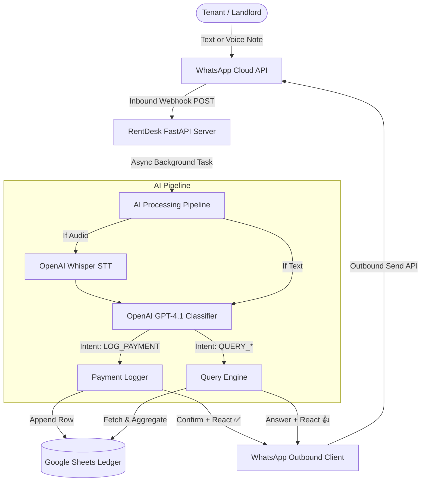

# RentDesk 🏢💬

> **AI-powered WhatsApp assistant that automates rental bookkeeping, logs payments directly to Google Sheets, and answers tenant balance queries in real time.**

[](https://www.python.org/downloads/)
[](https://fastapi.tiangolo.com)
[](https://platform.openai.com)
[](https://developers.facebook.com/docs/whatsapp/cloud-api)
[](https://developers.google.com/sheets/api)

---

## 🌟 Overview

**RentDesk** transforms your WhatsApp business or property manager chat into an intelligent, autonomous rental desk. Landlords, property managers, and tenants can log payments, inquire about dues, check past histories, or send voice notes in **English, Urdu, Hindi, or Roman Urdu/Hindi**.

The bot classifies the intent using **OpenAI GPT-4.1 structured outputs**, writes directly to your **Google Sheets ledger**, sends immediate emoji reactions (`✅`, `👍`), and returns human-readable financial summaries.

---

## ✨ Features

- **🗣️ Multilingual & Bilingual Parsing**: Handles natural conversational English, Hindi, and Roman Urdu (e.g., *"Ali paid 15k for room 3"*, *"Mera balance kitna reh gaya hai?"*).
- **🎙️ Voice Note Processing**: Transcribes voice notes on the fly using OpenAI Whisper before extracting rent transactions.
- **📊 Live Google Sheets Sync**: Appends structured transaction records directly to your Google Sheet without manual data entry.
- **⚡ Instant Inquiries & Balances**: Computes balances, payment history, and month-by-month summaries instantly upon request.
- **💬 Native WhatsApp Feedback**: Acknowledges receipts immediately with message reactions (`✅`, `👍`), read receipts, and formatted Markdown receipts.
- **🔒 Zero-Bloat Architecture**: Streamlined FastAPI backend with zero-config local SQLite message logging and dynamic Meta token handling.

---

## 🏗️ Architecture



---

## 📋 Supported WhatsApp Interactions

| Intent | Example Messages | Action |
| :--- | :--- | :--- |
| **Log Payment** | `"Ali paid 15,000 for room 3"`<br>`"Usman ne October ka 20k diya"` | Validates fields, appends to Google Sheet, reacts with `✅`, and replies with confirmation receipt. |
| **Check Due / Rent** | `"What is my rent this month?"`<br>`"Kitna rent bacha hai mera?"` | Computes balance owed and replies with breakdown. |
| **Payment History** | `"How much Ali has paid?"`<br>`"Ali ki payment history dikhao"` | Fetches all ledger entries for tenant and replies with an itemized statement. |
| **Summary** | `"All tenant status for October"` | Summarizes payment status across rooms for the given period. |
| **Voice Notes** | *Voice recording describing rent payment* | Downloads media, transcribes with Whisper, and processes seamlessly. |

---

## 🚀 Quick Start

### 1. Prerequisites
- Python 3.12+
- A [Meta Developer Account](https://developers.facebook.com/) with WhatsApp Cloud API configured
- A [Google Cloud Console](https://console.cloud.google.com/) project with Google Sheets API enabled
- An [OpenAI API Key](https://platform.openai.com/)
- [ngrok](https://ngrok.com/) (for local webhook tunneling)

### 2. Installation

Clone the repository and install dependencies:

```bash
git clone git@github.com:Nabos23/RentDesk.git
cd RentDesk

python -m venv .venv
# Windows:
.venv\Scripts\activate
# Linux/macOS:
source .venv/bin/activate

pip install -e .
```

### 3. Configuration

Copy the example environment configuration:

```bash
cp .env.example .env
```

Populate `.env` with your credentials:

```ini
# WhatsApp Business API
WHATSAPP_ACCESS_TOKEN=EAA...
WHATSAPP_PHONE_NUMBER_ID=1278129008726094
WHATSAPP_WABA_ID=your_waba_id
WHATSAPP_VERIFY_TOKEN=your_secure_verify_token

# OpenAI
OPENAI_API_KEY=sk-...
DEFAULT_MODEL=gpt-4.1
WHISPER_MODEL=whisper-1

# Google Sheets
GOOGLE_CLIENT_ID=your_client_id.apps.googleusercontent.com
GOOGLE_CLIENT_SECRET=your_client_secret
SPREADSHEET_ID=your_google_sheet_id
LEDGER_SHEET_NAME=Ledger
```

---

## 📊 Google Sheets Setup

1. Create a Google Sheet and name your primary sheet tab **Ledger**.
2. RentDesk will automatically ensure the header row exists:
   `Date | Tenant Name | Room Number | Amount (PKR) | Type | Month/Year | Notes | Source Message | Group ID | Sender Phone`
3. Download your Google OAuth client JSON as `google_credentials.json` in the root directory.
4. Visit `http://localhost:8000/auth/google/connect` in your browser to authorize your account. Tokens will be cached in `google_token.json`.

---

## 🏃 Running the Application

### 1. Start the API Server
```bash
python -m uvicorn app.main:app --reload --port 8000
```

### 2. Expose the Webhook Endpoint with ngrok
```bash
ngrok http 8000
```

### 3. Configure Meta Webhook
1. Go to your **Meta App Dashboard** → **WhatsApp** → **Configuration**.
2. Set **Callback URL** to: `https://<your-ngrok-domain>.ngrok-free.dev/webhook`
3. Enter your `WHATSAPP_VERIFY_TOKEN` and click **Verify and Save**.
4. In **Webhook fields**, subscribe to **`messages`**.

---

## 🛠️ Diagnostics & Testing

RentDesk includes a built-in diagnostic runner to test the end-to-end pipeline without needing live mobile triggers:

```bash
python debug_runner.py
```

This verifies:
- Configuration and environment settings
- Meta Cloud API credentials and registered phone status
- Ngrok tunnel health and webhook GET/POST reachability
- OpenAI query parsing and Google Sheets data retrieval
- Outbound WhatsApp test messages and reactions

---

## 📁 Project Structure

```
RentDesk/
├── app/
│   ├── ai/
│   │   ├── pipeline.py            # Main intake, classification, and routing
│   │   └── voice.py               # Audio conversion and Whisper transcription
│   ├── auth/
│   │   └── google_oauth.py        # OAuth 2.0 flow for Google Sheets
│   ├── connectors/
│   │   ├── google_sheets_ledger.py# Google Sheets API connector & operations
│   │   └── whatsapp_client.py     # Outbound WhatsApp Cloud API connector
│   ├── core/
│   │   ├── config.py              # Pydantic environment configuration
│   │   ├── database.py            # SQLite message logging
│   │   └── logging.py             # Structured logging setup
│   ├── rent/
│   │   ├── extractor.py           # Structured output parsing & prompt logic
│   │   ├── query_handler.py       # Ledger aggregation & financial response formatting
│   │   └── schemas.py             # Pydantic schemas & enums
│   ├── webhook/
│   │   └── routes.py              # Meta webhook verification & event dispatch
│   └── main.py                    # FastAPI application entrypoint
├── debug_runner.py                # Pipeline diagnostic runner
├── pyproject.toml                 # Dependencies and project metadata
└── README.md
```

---

## 📄 License

This project is licensed under the MIT License.
